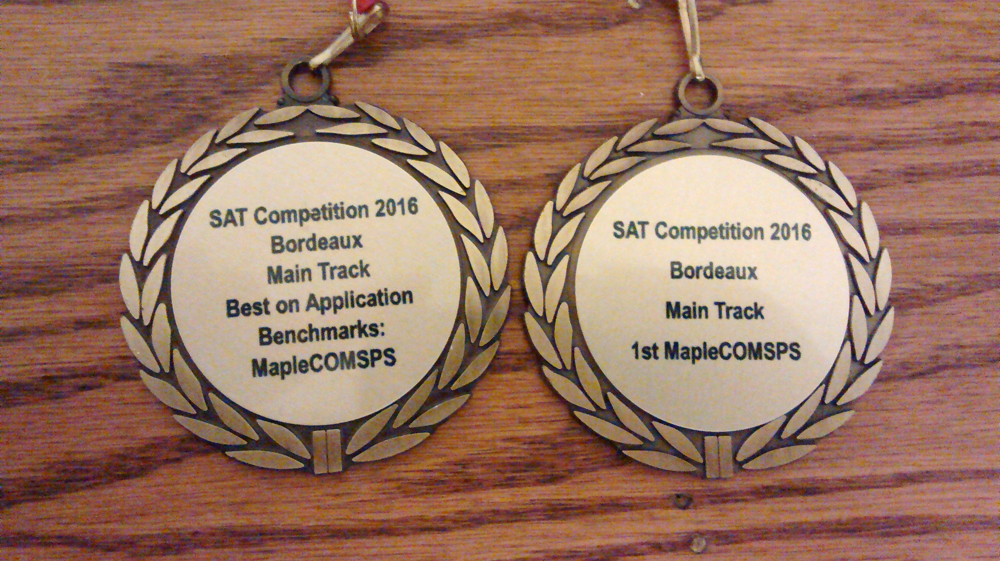

# Complexity Theory of Solvers

Conflict-driven clause-learning (CDCL) SAT solvers, as well as satisfiability modulo theories (SMT) solvers, routinely solve formulas with thousands to millions of variables and clauses, despite the satisfiability problem being NP-complete. At the same time, small randomly generated formulas are difficult for the same solvers. The goal of this work is to understand which aspects of modern SAT/SMT solvers, as well as which measures of SAT/SMT formulas, relate best to solving performance.

Our line of work follows along 4 main lines of reasoning:
* Deriving proof complexity lower bounds to demonstrate the hardness of certain formulas for modern solvers;
* Deriving parameterized complexity upper bounds to demonstrate how certain measures of formulas relate to hardness;
* Characterizing SAT/SMT solvers through the lens of machine learning;
* Improving our understanding of encodings and reductions of formulas.

# News
* MapleSAT is now the default SAT solver used in the computer algebra system [Maple 2018](https://www.maplesoft.com/products/maple/new_features/maple2018/performance.aspx).
* MapleCOMSPS won 2nd in the [SAT Competition 2017](https://baldur.iti.kit.edu/sat-competition-2017/index.php?cat=results) Main track and No-limits track!
* MapleCOMSPS won 1st in the [SAT Competition 2016](http://baldur.iti.kit.edu/sat-competition-2016/index.php?cat=results) Main track and 2nd in the Application category!
* MapleCOMSPS_LRB won 1st in the [SAT Competition 2016](http://baldur.iti.kit.edu/sat-competition-2016/index.php?cat=results) Application category!

